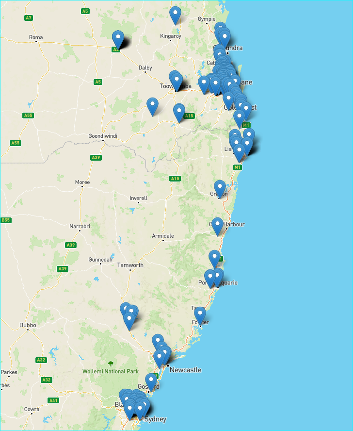
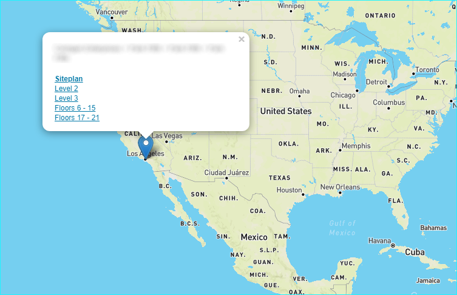
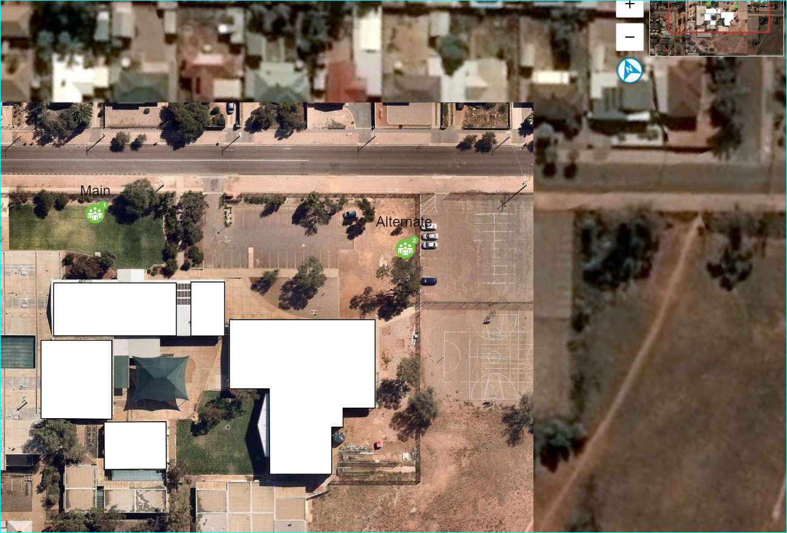
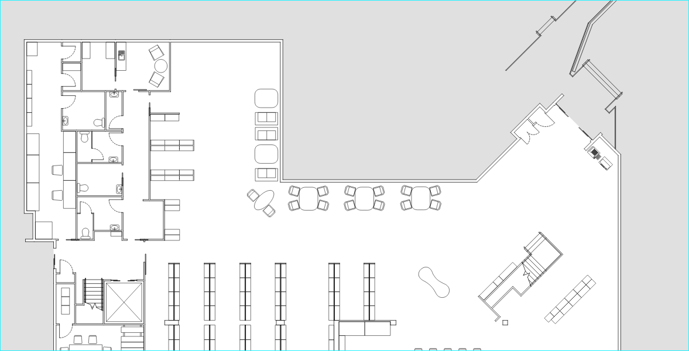

# ESAPI Browser

## Overview

This console application uses the [Enterprise Services API](https://api.locatrix.com/esapi/api/docs/index.html) (ESAPI) from [Locatrix](https://locatrix.com) and .NET Core 3.1.

The application illustrates how to:
- enumerate the data structure all of the enities that you are able to access from your partnership.
- drill-in progressively to the buildings data schema as follows:

```
	- Partnerships
	-- Clients
	--- Campuses (also known as Sites)
	---- Buildings
	----- Floors
```

- launch the Embed API for both `Siteplans` and `Floorplans`
- display building outlines

Each `Campus` has a `Plan` which is referred to ubiquitously as a `Siteplan` (rather than a `Campusplan`).

Every `Floor` also has a `Plan`.

When executed, the application will create/overwrite a data file `building-data.geojson.js` which is referenced from the HTML file `building-outlines-example.html`.  
The `building-data.geojson.js` file contains the data for each building as a map `drop pin`.

Once the console application has been executed double-click the file `building-outlines-example.html` to display a map using [Leaflet](https://leafletjs.com/) to indicate each location of a building.

Clicking on a drop pin will allow you to view the building details and launch the Locatrix Embed API to view and interact with the plan selected.

## Learnings

1. Enumerating the data hierarchy
1. Creating View Tokens for the Embed API links
1. Obtaining and displaying building outlines

## Siteplan and Floor View tokens
The example also illustrates the mechanism to create an Embed API viewing token and to subsequently use this in your UI as a link.

## Prerequisites

- [.NET Core 3.1.402](https://dotnet.microsoft.com/download/dotnet-core/3.1) or higher.
- The application must have been executed at least once to generate the data file against your partnership.

## Quick Start

* `dotnet run` 
*  When finished executing open [the statically served HTML file](file://building-outlines-example.html) from Windows File Explorer to view the map in your browser.

## Deep Dive
- Adjust the Application and API Key for your account.


## Example screen shots

### Map View
The image below shows how the map looks for a partnership that has many buildings



### Drop pin click
A pop up allowing identification of the building and viewing of the floors is presented if you click on any drop pin.




### Site plan view
Clicking the `Siteplan` link in the drop pin pop up will show the site plan in the Embed API in a new browser tab.




### Floor plan view
Clicking a `Floor` link in the drop pin pop up will show the floorplan in the Embed API in a new browser tab.



